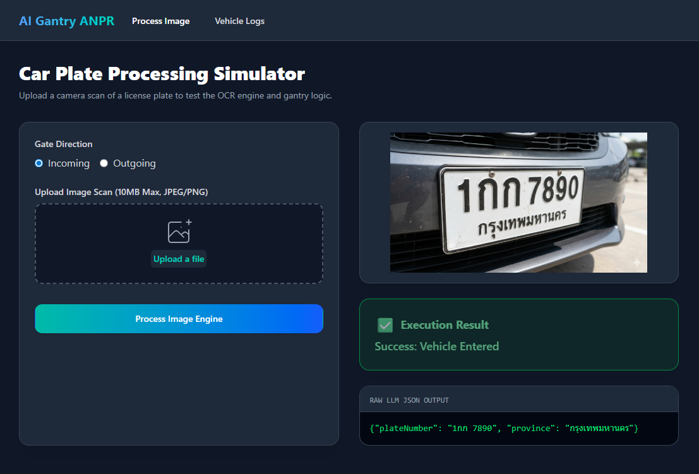
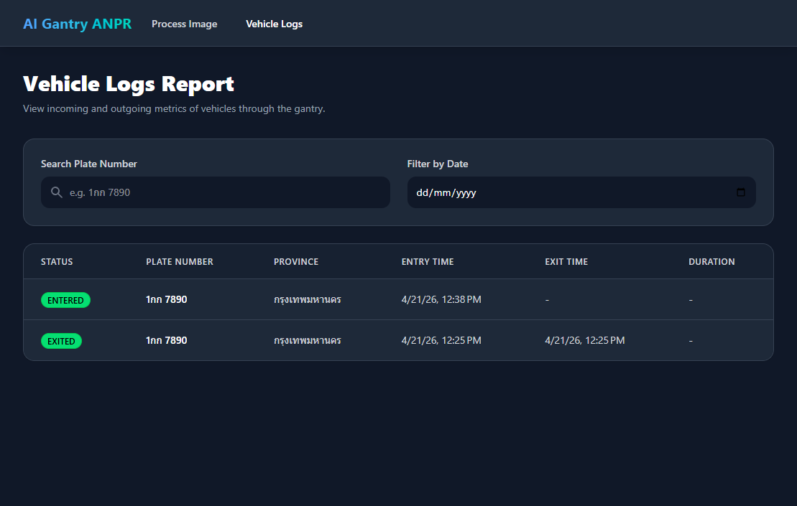

# AI-Powered Thai Car Gantry ANPR System 🚗🤖

An end-to-end Automated Number Plate Recognition (ANPR) prototype designed for restricted zone access control. This system acts as a "digital bouncer," utilizing local multimodal AI to extract complex Thai license plate text via Optical Character Recognition (OCR), process the data through a Node.js backend, and log entry/exit states in a PostgreSQL database.

## 📸 Screenshots

| Process Car Plate | Vehicle Logs |
|:---:|:---:|:---:|
|  |  


## 💡 The Business Problem
Traditional gantry systems rely on expensive, proprietary OCR hardware. This prototype demonstrates how modern, open-weight multimodal Large Language Models (LLMs) can be integrated into a full-stack environment to achieve highly accurate, localized text extraction (Thai script) using standard camera feeds.

## 🏗️ Architecture & Tech Stack
This project leverages a modern, decoupled architecture:
* **Frontend:** Angular v21, Tailwind CSS (Dark Theme), SCSS
* **Backend:** Node.js, Express, TypeScript
* **Database & ORM:** PostgreSQL, Prisma ORM
* **AI Engine:** LM Studio (Local Inference) running Qwen 3.5 (Multimodal/Vision)

## ✨ Key Features
* **AI Vision Processing:** Passes raw vehicle images to a local LLM, instructing it to extract the plate number and return a strictly formatted JSON payload.
* **Full-Stack State Management:** Tracks the complete lifecycle of a vehicle (Entry $\rightarrow$ Duration $\rightarrow$ Exit).
* **Interactive Admin Dashboard:**
  * **Simulator Tab:** Upload a vehicle photo, view the raw AI JSON response, and see the database execution result in real-time.
  * **Incoming/Outgoing Logs:** Filterable data tables tracking registered vehicles, timestamps, and access denials.
* **Complex Localization:** Successfully parses non-Latin characters and province designations (e.g., "1กก 7890 กรุงเทพมหานคร").

## 🚀 Getting Started

### 1. Prerequisites
* Node.js & npm
* PostgreSQL running locally (Database must be set to `UTF8` encoding)
* LM Studio installed with a multimodal model (e.g., Qwen 3.5) running on port `1234`.

### 2. Backend Setup
```bash
cd backend
npm install
# Configure your .env file with DATABASE_URL
npx prisma db push
npx ts-node prisma/seed.ts # Seeds the DB with a test vehicle
npm run start
```
